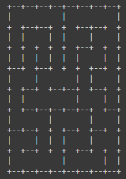
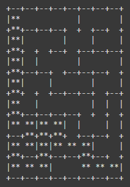
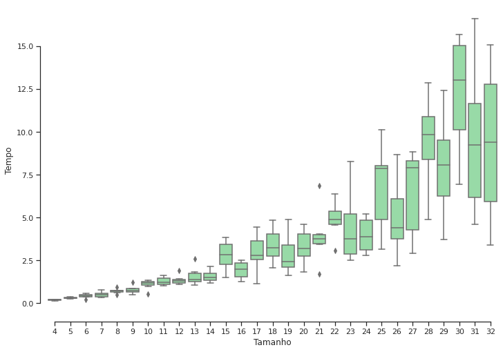

# Busca A* para resolução de labirintos
Busca A* para resolução de labirintos em python, com função de plot e testes de performance.

O algoritmo A* decide qual caminho seguir com base no custo de cada uma das células do labirinto, sempre selecionando o caminho com custo mínimo. O custo de uma célula $n$ é definido como:

$$
f(n) = g(n) + h(n)
$$

Onde:
- $f(n)$ representa o custo total para atingir a célula $n$;
- $g(n)$ é o custo real para alcançar a célula $n$ a partir da célula inicial;
- $h(n)$ é o custo heurístico para chegar à célula objetivo a partir da célula $n$.

A escolha adequada da função heurística é um dos fatores essenciais para o desempenho do algoritmo A*. Neste projeto, utilizamos a **distância de Manhattan** como função heurística:

$$
d(x, y) = \sum_{i=1}^{n} |x_i - y_i|
$$

É a inclusão do custo Heurístico no algoritmo A* que o torna eficiente em comparação ao BFS ou DFS, pois o algoritmo seleciona as células com custo mínimo (custo real + custo estimado) e, portanto, se aproxima do objetivo rapidamente.

Exemplo de labirinto com 8x8 células gerado:

Exemplo de labirinto resolvido:

Avaliação do algoritmo com 174 labirintos, 6 labirintos para cada dimensão que vão de  4×4  a  32×32  células:

[Referência](https://levelup.gitconnected.com/a-star-a-search-for-solving-a-maze-using-python-with-visualization-b0cae1c3ba92) 
